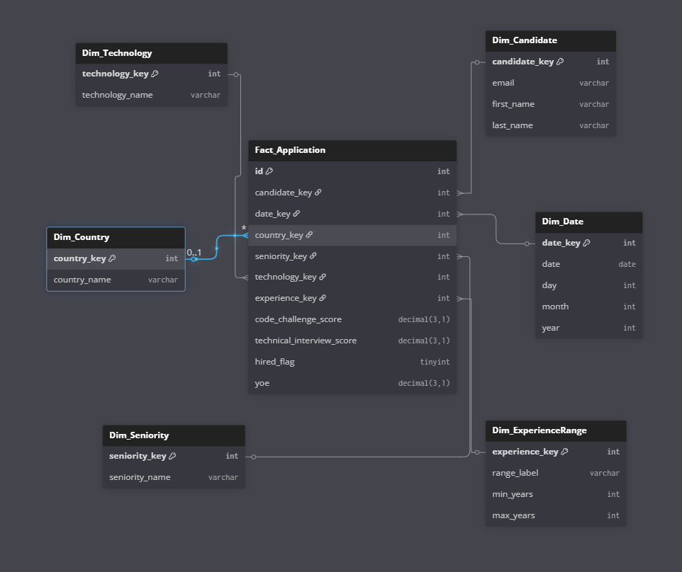

# 🚀 ETL Workshop 1 – Data Engineering Challenge

## 📌 Introduction

This project is part of **Workshop 1 of the ETL (Data Engineering and AI) course**.
It simulates a technical interview challenge, where an **end-to-end ETL pipeline** is built:

1. **Extract** → read data from a CSV file with 50k candidate records.
2. **Transform** → apply business rules (e.g., a candidate is considered *HIRED* if both scores ≥ 7), clean, and structure the data into a **dimensional model (Star Schema)**.
3. **Load** → load the transformed data into a **Data Warehouse (MySQL)**.
4. **Visualization** → build **KPIs** and charts that query the DW (not the CSV).

---

## 📂 Repository Structure

```bash
.
├── csv/
│   └── candidates.csv        # Initial dataset (50k random records)
├── etl/
    ├── main.py               # Entry point, ETL orchestration
    ├── etl.py                # Extract & Transform
    ├── db.py                 # Table creation and SQL backup
    ├── connection.py         # MySQL connection
    ├── query.py              # SQL queries for KPIs
    ├── visualization.py      # KPI visualization dashboard
    ├── workshop.sql          # Automatically generated SQL backup
    ├── star_schema.png       # Dimensional model diagram (add image)
    ├── README.md             # Project documentation
    └── .gitignore            # Ignored files
```

---

## 🛠️ Technologies Used

* **Python 3.13.7**
* **MySQL** as the Data Warehouse
* **pandas** for data manipulation
* **matplotlib & seaborn** for visualizations
* **mysql-connector-python** for database connection

---

## ⚙️ Installation & Execution

1. **Clone the repository**:

```bash
git clone https://github.com/JuanHoyos329/workshop_1.git
cd ./workshop_1/etl/
```

2. **Install dependencies**:

```bash
pip install -r requirements.txt
```

3. **Configure MySQL connection** in `connection.py`:

```python
DB_CONFIG = {
    "host": "localhost",
    "user": "root",
    "password": "your_password",
    "database": "etl_workshop"
}
```

4. **Run the ETL pipeline**:

```bash
python etl/main.py
```

---

## 📊 Dimensional Model (Star Schema)

The model follows a **star schema**:

* **Fact Table**: `Fact_Application`
* **Dimensions**:

  * `Dim_Candidate`
  * `Dim_Date`
  * `Dim_Country`
  * `Dim_Seniority`
  * `Dim_Technology`
  * `Dim_ExperienceRange`

👉 Add your **`star_schema.png` diagram here**.

---

## 📈 KPIs & Visualizations

All KPIs are queried directly from the **DW (MySQL)**, never from the CSV.

1. Hires by Technology (Top 10).
2. Hires by Year (trend).
3. Hires by Seniority.
4. Hires by Country (USA, Brazil, Colombia, Ecuador).
5. Hire Rate Analysis (Top Technologies).
6. Experience Analysis (Hire Rate & Scores).

---

## ✅ Deliverables

* **ETL scripts**
* **Dimensional model (diagram + justification)**
* **SQL queries (query.py)**
* **KPIs and visualizations**
* **README.md with setup & instructions**
* **.gitignore**

---

## 📌 Evaluation Criteria

* Organized and clean repository
* Clear and detailed README
* Justified dimensional model
* Correct DW migration
* Correct queries from DW
* Clear KPIs and visualizations
* Documentation of process and assumptions

---

### 📷 How to Add an Image (e.g., `star_schema.png`)

To display your diagram in the README (on GitHub):

```markdown
## 📊 Dimensional Model (Star Schema)


```

🔹 Notes:

* The path should match your repo’s structure (`etl/star_schema.png` if inside `etl/`).
* GitHub automatically renders PNG/JPG inside markdown.
* Keep the image inside your repo (don’t use local paths like `C:\...`).

---

👉 ¿Quieres que te lo prepare en formato **README.md completo en inglés** (con el snippet de imagen ya insertado) para que lo pegues directo a tu repo?
